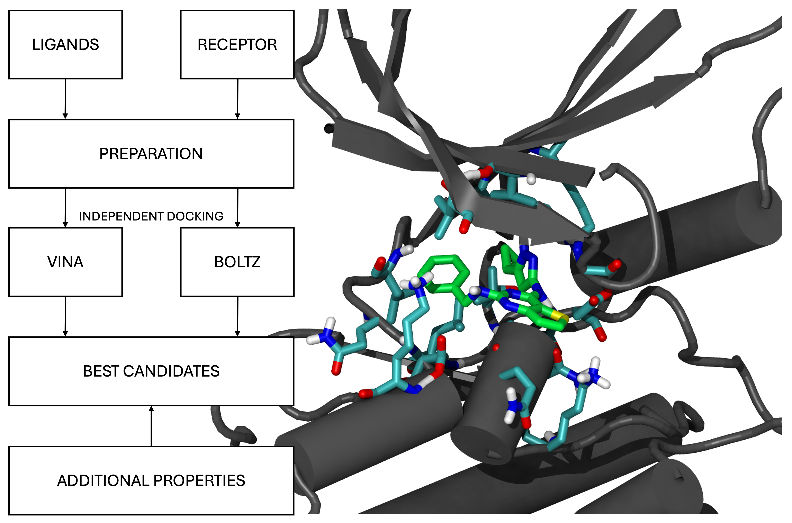

# Vina-Boltz-workflow
A fully automated workflow for computer-aided drug discovery (CADD). This workflow was generated with the AI assistance of Claude 4.5 Sonnet (Anthropic, 2025). Parallel docking with AutoDock Vina and Boltz is employed to predict potential drug candidates.

# Introduction
This workflow automates the process of screening multiple molecules (stored as SMILES in a .csv file) against a specific protein target. Once the user selects the dataset of molecules and the receptor, two independent docking protocols will be executed: Autodock-Vina docking and Boltz. A dedicated protocol will merge the two docking results, and additional features will be added. In the end, the most suitable candidates are presented to the user. 

<p align="center">

</p>
<p align="center">
<em>Schematic view of the workflow and one of the best candidates (id-num 25)</em>
</p>
All the outputs are provided for a dataset of ≈300 molecules for an alternative inhibitor of CDK2. There are two ways to utilize this workflow: one involves automated bash.sh commands for both Vina and Boltz, along with extracting several candidates with additional properties. The second would be to follow the documentation file and run each step separately to have precise control over each step. In both cases, the commands (.py or .sh) must be executed with a previously activated environment, as outlined below.  

# Environments and Installations

I recommend separate environments for the 3 steps: [AutoDock Vina](https://autodock-vina.readthedocs.io/en/latest/installation.html#python-bindings-linux-and-mac-only), [Boltz-2](https://github.com/forlilab/molscrub), and the additional features. The reason is that they might have conflicts in the same environment, and this also allows us to have more control in each step of this workflow. In the future, we may have a single environment and a more harmonized workflow structure. 

## Autodock-Vina

```
conda create -n vina python=3
conda activate vina
```

The following command to install NumPy and AutoDock Vina:

```
conda install -c conda-forge numpy swig boost-cpp libboost sphinx sphinx_rtd_theme
pip install vina
```

In the same environment of vina we also need to install [molscrub](https://github.com/forlilab/molscrub).

```
git clone git@github.com:forlilab/molscrub.git
cd molscrub
pip install -e .
```

We also need [Meeko](https://meeko.readthedocs.io/en/release-doc/) for generating the .pdbqt files.

```
conda install meeko
```

## For Boltz-2: 

We also need a dedicated environment for boltz 

```
conda create -n boltz2 python=3.11 -y
conda activate boltz2

pip install boltz
```

In my case, I don't have a dedicated GPU, and I will run everything on the CPU.

## Deepchem: additional properties

I will also need a dedicated environment for the DeepChem package used for calculating additional properties:

```
conda create -n deepchem_env
conda activate deepchem_env
pip install deepchem
```

# Running the workflow

Before running the workflow, we must prepare the ligands (a .csv file with smiles) and the receptor (see [Docs/documentations.md](Docs/documentations.md)), but for simplicity, I'm already providing them in the `Autodock-Vina/ligands` and `Autodock-Vina/receptor`. Each step includes dedicated logging, and examples can be found in the documentation.

If everything has been installed correctly, we can now run the workflow by activating the environment and executing the following command:

```
conda activate vina
# Make sure .sh is executable
chmod +x run-vina.sh
./run-vina.sh
```

At the end, inside the `Autodock-Vina/poses`, you will find the dataset with the vina scores `list_with_affinities.csv`. 

Next, we can run the bash code for boltz and sort the best candidates (again, this can also be run as single step by following the [Docs/documentations.md](Docs/documentations.md)):

```
conda activate boltz2
# Make sure .sh is executable
chmod +x run-boltz.sh
./run-boltz.sh
```

At the end, we will see in the main boltz folder the file `list_with_affinities_boltz.csv`.

'list-sorted.csv' and `list-best10.csv`. In this case, the sorting is based on the average binding energy obtained by both methods. 

Finally, we can run DeepChem and RDKit for sorting the molecules and the additional properties calculation

```
conda activate deepchem_env
python sorting.py
python additional-descriptors.py
```

Now we should see the full list of candidates ordered by the average binding energy obtained by both docking methods `list-sorted.csv`, the best `list-best10.csv`, and `candidates.csv` with feature extractions. The console should also print you the final results.

